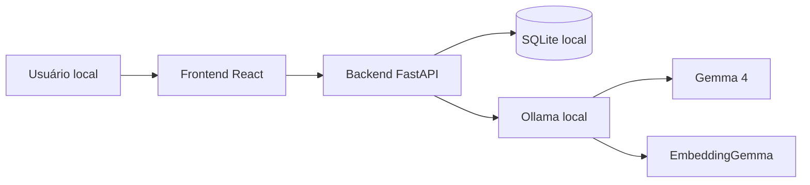
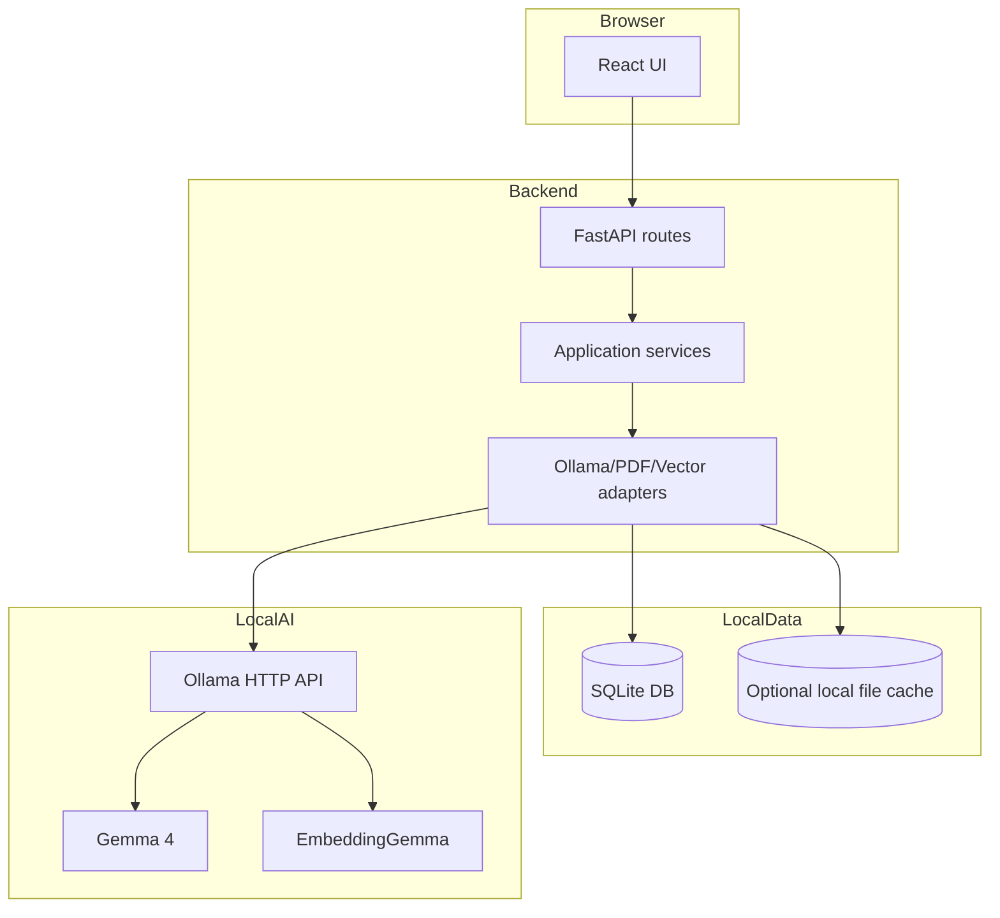
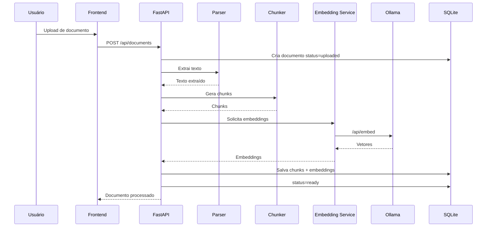
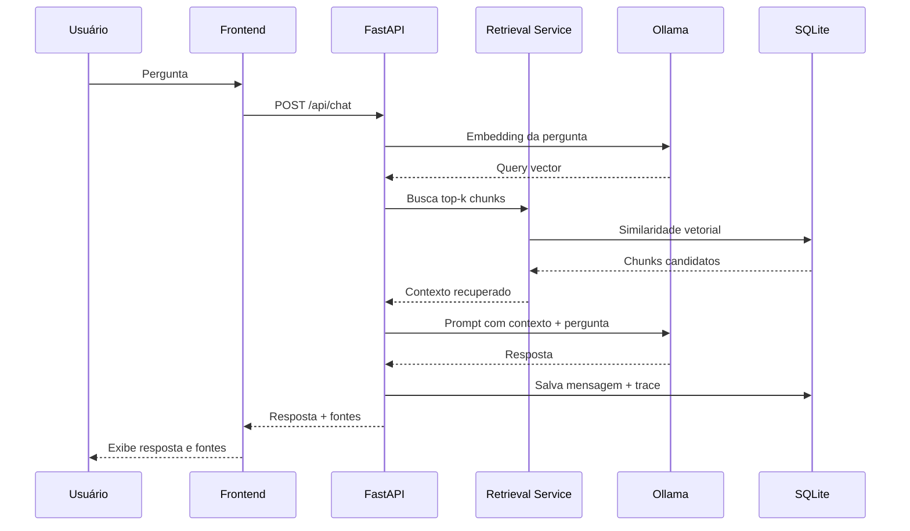

# Architecture Spec

## 1. Objetivos de arquitetura

A arquitetura deve equilibrar simplicidade e clareza. O MVP não precisa de microserviços, filas externas ou deploy complexo. Ele precisa ser modular o suficiente para demonstrar engenharia profissional e permitir evolução.

Objetivos:

- rodar localmente;
- isolar integração com modelos;
- permitir testes sem modelo real;
- separar domínio, serviços, API e persistência;
- permitir evolução para PostgreSQL/pgvector;
- deixar o pipeline de RAG observável.

## 2. Visão C4 simplificada

### Contexto



### Containers



## 3. Componentes principais

### Frontend

Responsabilidades:

- exibir status do ambiente;
- importar documentos;
- listar biblioteca;
- exibir chat;
- exibir fontes;
- exibir erros acionáveis.

Não deve conter regra de RAG, chunking ou acesso direto ao Ollama.

### Backend API

Responsabilidades:

- validar requests;
- coordenar serviços;
- controlar erros;
- expor contratos REST;
- preservar regras de segurança.

### Serviços de aplicação

Responsabilidades:

- ingestão de documentos;
- extração e chunking;
- embeddings;
- retrieval;
- geração;
- rastreabilidade.

### Adapters

Responsabilidades:

- encapsular detalhes de bibliotecas e APIs;
- facilitar mocks em testes;
- reduzir acoplamento com Ollama, PDF parser e vector store.

### Banco local

Responsabilidades:

- persistir documentos;
- persistir chunks;
- persistir embeddings;
- persistir sessões e mensagens;
- persistir traces.

## 4. Fluxo de ingestão



## 5. Fluxo de chat



## 6. Separação de responsabilidades

| Camada | Pode fazer | Não deve fazer |
|---|---|---|
| UI | renderizar estados, chamar API | acessar Ollama diretamente |
| API | validar request, chamar serviços | conter lógica pesada de RAG |
| Services | coordenar caso de uso | saber detalhes de HTTP do Ollama |
| Adapters | integrar bibliotecas/APIs | decidir regra de negócio |
| DB | persistir | gerar resposta |

## 7. Evolução futura

A arquitetura deve permitir:

- trocar SQLite por PostgreSQL + pgvector;
- trocar Ollama por outro runtime local;
- adicionar reranking;
- adicionar OCR;
- adicionar filas para ingestão assíncrona;
- adicionar autenticação se houver deploy público.

## 8. Trade-offs

### SQLite no MVP

Prós:

- instalação simples;
- local-first;
- fácil reset;
- bom para portfólio.

Contras:

- menos adequado para multiusuário;
- busca vetorial depende de extensão ou implementação simples.

### FastAPI

Prós:

- tipagem com Pydantic;
- OpenAPI automático;
- testes fáceis;
- boa separação para serviços.

Contras:

- exige stack Python além do frontend.

### Ollama

Prós:

- runtime local acessível;
- API simples;
- suporta modelos de chat e embeddings;
- boa experiência para demo.

Contras:

- depende de hardware e modelos baixados;
- performance varia por máquina.

## 9. Diagrama de arquivos

```text
backend/src/sialabs_local_rag/
  api/
    health.py
    models.py
    documents.py
    chat.py
    traces.py
  adapters/
    ollama_chat.py
    ollama_embeddings.py
    pdf_parser.py
    vector_store.py
  config/
    settings.py
  db/
    models.py
    repositories.py
    session.py
  domain/
    entities.py
    errors.py
    value_objects.py
  services/
    ingestion.py
    chunking.py
    retrieval.py
    generation.py
    tracing.py
  main.py
```
