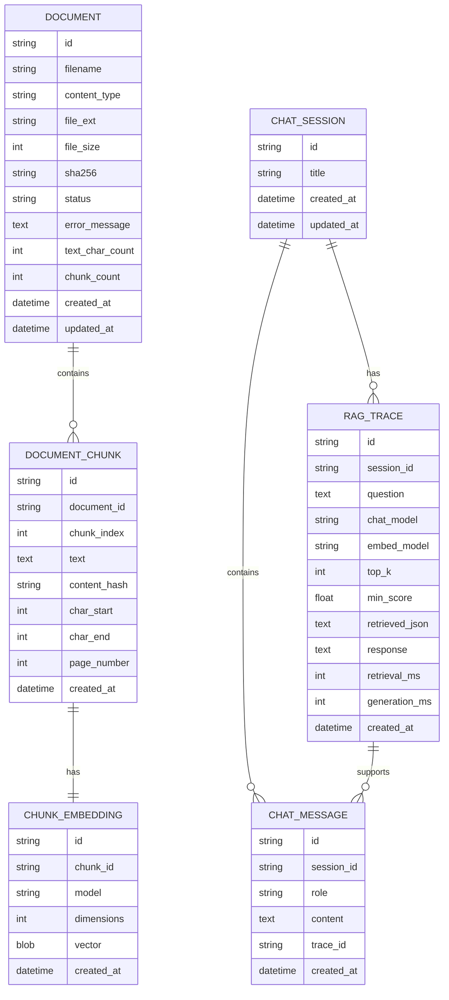

# Data Model Spec

## 1. Objetivo

Definir o modelo de dados do MVP local-first.

O banco precisa guardar documentos, chunks, embeddings, sessões de chat, mensagens e traces do pipeline RAG.

## 2. Entidades

### Document

Representa um arquivo importado.

Campos:

| Campo | Tipo | Observação |
|---|---|---|
| id | string/uuid | identificador interno |
| filename | string | nome original sanitizado |
| content_type | string | MIME detectado |
| file_ext | string | `.txt`, `.md`, `.pdf` |
| file_size | integer | bytes |
| sha256 | string | deduplicação |
| status | enum | uploaded, processing, ready, failed |
| error_message | text/null | falha de parsing/embedding |
| text_char_count | integer | total extraído |
| chunk_count | integer | total de chunks |
| created_at | datetime | criação |
| updated_at | datetime | atualização |

### DocumentChunk

Representa um trecho recuperável.

Campos:

| Campo | Tipo | Observação |
|---|---|---|
| id | string/uuid | identificador |
| document_id | FK | documento pai |
| chunk_index | integer | ordem no documento |
| text | text | conteúdo do chunk |
| content_hash | string | hash do texto |
| char_start | integer/null | posição inicial |
| char_end | integer/null | posição final |
| page_number | integer/null | quando disponível |
| created_at | datetime | criação |

### ChunkEmbedding

Representa vetor do chunk.

Campos:

| Campo | Tipo | Observação |
|---|---|---|
| id | string/uuid | identificador |
| chunk_id | FK | chunk |
| model | string | exemplo: `embeddinggemma` |
| dimensions | integer | tamanho do vetor |
| vector | blob/text/vector | depende da implementação |
| created_at | datetime | criação |

### ChatSession

Representa uma conversa.

Campos:

| Campo | Tipo | Observação |
|---|---|---|
| id | string/uuid | identificador |
| title | string/null | título gerado ou manual |
| created_at | datetime | criação |
| updated_at | datetime | atualização |

### ChatMessage

Representa mensagens do usuário e assistente.

Campos:

| Campo | Tipo | Observação |
|---|---|---|
| id | string/uuid | identificador |
| session_id | FK | sessão |
| role | enum | user, assistant, system |
| content | text | conteúdo |
| trace_id | FK/null | trace associado |
| created_at | datetime | criação |

### RagTrace

Representa execução do pipeline.

Campos:

| Campo | Tipo | Observação |
|---|---|---|
| id | string/uuid | identificador |
| session_id | FK/null | conversa |
| question | text | pergunta original |
| chat_model | string | modelo de geração |
| embed_model | string | modelo de embeddings |
| top_k | integer | configuração |
| min_score | float | configuração |
| retrieved_json | json/text | chunks e scores |
| prompt_preview | text/null | opcional, sem dados sensíveis em logs externos |
| response | text | resposta |
| retrieval_ms | integer/null | tempo |
| generation_ms | integer/null | tempo |
| created_at | datetime | criação |

## 3. Diagrama ER



## 4. Índices recomendados

- `documents.sha256` unique.
- `documents.status`.
- `document_chunks.document_id`.
- `document_chunks(document_id, chunk_index)` unique.
- `chunk_embeddings.chunk_id` unique.
- `chat_messages.session_id`.
- `rag_traces.session_id`.
- Índice vetorial conforme tecnologia escolhida.

## 5. Estados do documento

```text
uploaded -> processing -> ready
uploaded -> processing -> failed
ready -> deleted
failed -> deleted
```

No MVP, exclusão pode ser hard delete local.

## 6. Migrações

Toda alteração estrutural deve gerar migration.

Comandos esperados:

```powershell
uv run alembic upgrade head
uv run alembic current
```

## 7. Dados de demo

Criar arquivos em `demo/`, não inserir dados reais.

Exemplos:

- `demo/sialabs-overview.md`
- `demo/local-ai-notes.md`
- `demo/sample-policy.txt`

## 8. Privacidade de dados

- Banco fica em `./data/` e deve ser ignorado pelo Git.
- Arquivos enviados não devem ser commitados.
- Apenas dados fictícios entram no repositório.
- Traces podem conter conteúdo de documentos; por isso também devem ficar locais.
